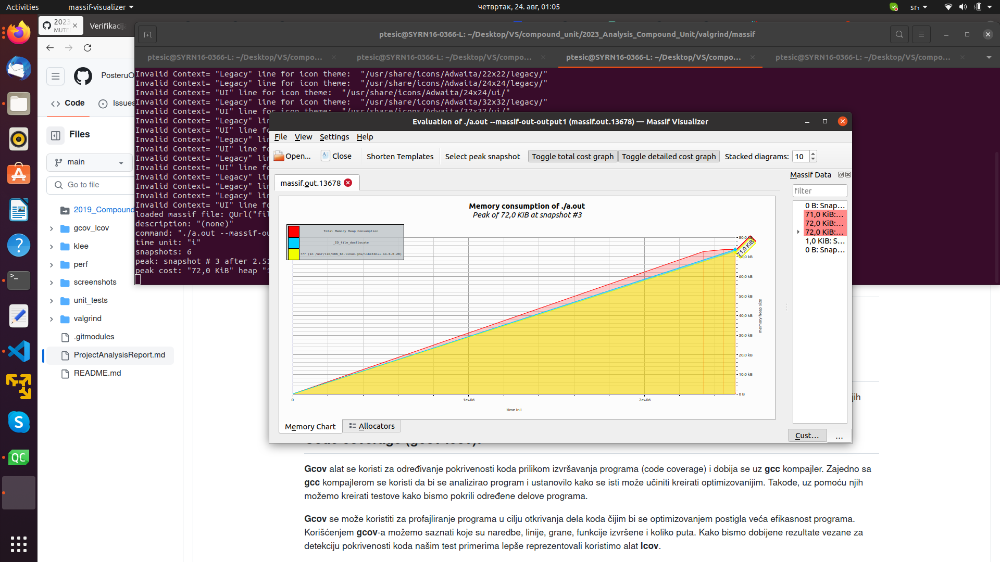
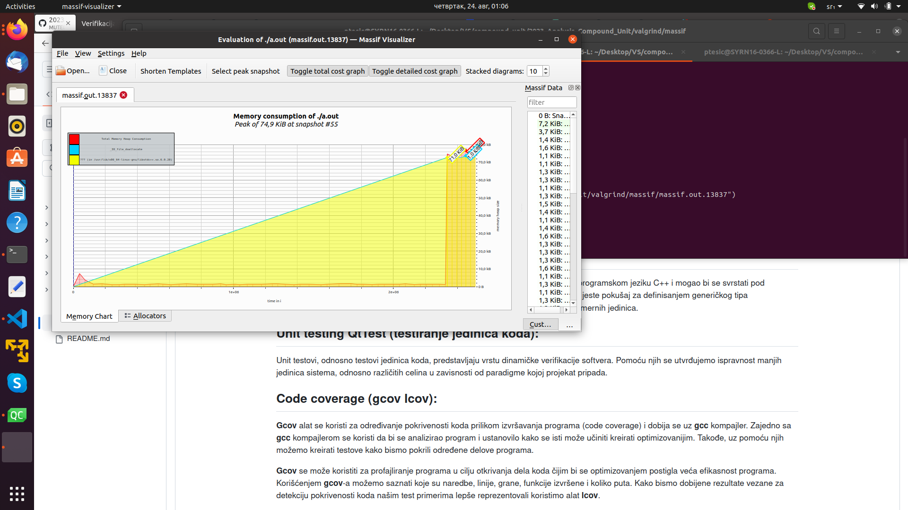
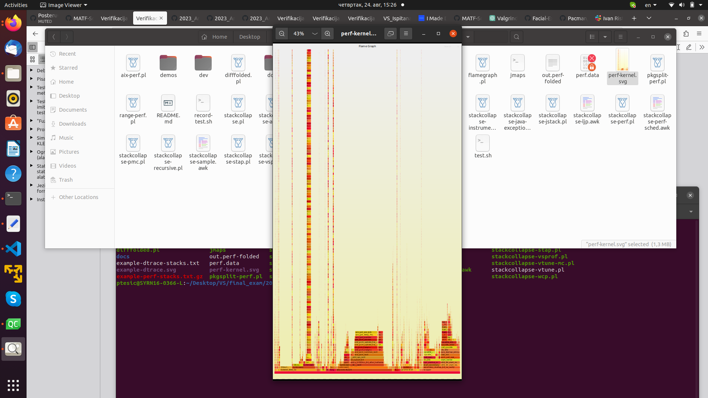
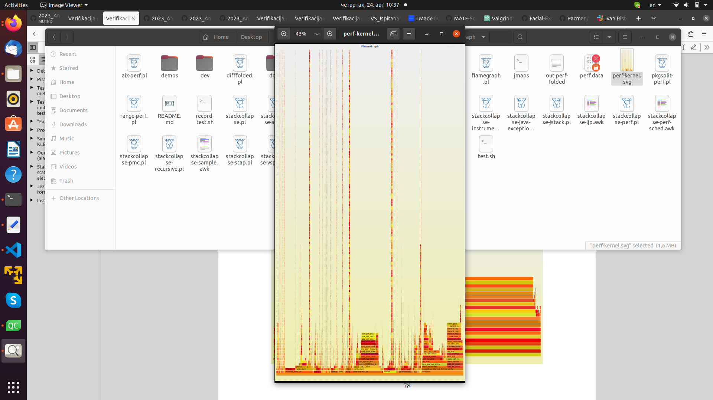

# Izveštaj analize projekta

## O projektu:
Projekat je urađen za potrebe kursa Programske paradigme.
Projekat je napisan u programskom jeziku C++ i mogao bi se svrstati pod funkcionalnu i generičku programsku paradigmu.
Osnovna ideja iza samog projekta jeste pokušaj za definisanjem generičkog tipa "compound_unit" (složena jedinica) koji bi bio korišćen za reprezentovanje različitih mernih jedinica.

## Unit testing QtTest (testiranje jedinica koda):
Unit testovi, odnosno testovi jedinica koda, predstavljaju vrstu dinamičke verifikacije softvera. Pomoću njih se utvrđujemo ispravnost manjih jedinica sistema, odnosno različitih celina u zavisnosti od paradigme kojoj projekat pripada.

## Code coverage (gcov lcov):
**Gcov** alat se koristi za određivanje pokrivenosti koda prilikom izvršavanja programa (code coverage) i dobija se uz **gcc** kompajler. 
Zajedno sa **gcc** kompajlerom se koristi da bi se analizirao program i ustanovilo kako se isti može učiniti kreirati optimizovanijim. Takođe, uz pomoću njih možemo kreirati testove kako bismo pokrili određene delove programa.

**Gcov** se može koristiti za profajliranje programa u cilju otkrivanja dela koda čijim bi se optimizovanjem postigla veća efikasnost programa. Korišćenjem **gcov**-a možemo saznati 
koje su naredbe, linije, grane, funkcije izvršene i koliko puta. Kako bismo dobijene rezultate vezane za detekciju pokrivenosti koda našim test primerima lepše reprezentovali koristimo alat **lcov**.

-Kratak pregled izgenerisanih .html stranica:


## Valgrind - memcheck:
- **Valgrind** je platforma otvorenog koda za kreiranje alata sposobnih za naprednu dinamičku analizu mašinskog koda (bilo povezanog bilo nepovezanog). **Valgrind** obuhvata nekoliko alata od kojih je svaki specijalizovan za detektovanje određenog problema.
- Prvi od **Valgrind**-ovih alata primenjenih nad projektom **compound unit** bio je **memcheck**.
- **Memcheck** kao alat koji si prilikom korišćenja **Valgrind**-a podrazumevano poziva, koristi se za detektovanje memorijskih grešaka i sprovođenja analize nad mašinskim kodom. Može se koristiti za otkrivanje više vrsta problema poput:
    - pristupanja ili upisivanje vrednosti van opsega;
    - pristupanja već oslobođenoj memoriji;
    - curenja memorije;
    - korišćenja neinicijalizovanih vrednosti...
Projekat je izgrađen pomoću komande:
```
g++ -std=c++17 -g -O0 -Wall ../../../2019_Compound-Units-master/demo.cpp -o test 
```
**Memcheck** alat je pokrenut na sledeći naćin:
```
valgrind --tool=memcheck --show-leak-kinds=all --leak-check=full --track-origins=yes ./test
```
Prilikom pokretanja alata memcheck jedan od izveštaja bio je sledeći:
```
==15262== Memcheck, a memory error detector
==15262== Copyright (C) 2002-2017, and GNU GPL'd, by Julian Seward et al.
==15262== Using Valgrind-3.15.0 and LibVEX; rerun with -h for copyright info
==15262== Command: ./test
==15262== 
Acceleration:
m^1s^-2

Merged two compound_units:
s^2s^3m^1s^-2

Condensing the two merged ones:
s^3m^1

Multiplying two compound_units:
m^5s^-3

Dividing two compound_units:
m^1s^-2

Dividing again two compound_units:
m^1s^0

Removing degrees that are equal to zero:
m^1

Unfolding a nested compound_unit:
m^2m^6s^-4m^-8

Formating the unfolded compound_unit:
s^-4

==15262== 
==15262== HEAP SUMMARY:
==15262==     in use at exit: 0 bytes in 0 blocks
==15262==   total heap usage: 2 allocs, 2 frees, 73,728 bytes allocated
==15262== 
==15262== All heap blocks were freed -- no leaks are possible
==15262== 
==15262== For lists of detected and suppressed errors, rerun with: -s
==15262== ERROR SUMMARY: 0 errors from 0 contexts (suppressed: 0 from 0)
```

Kao što možemo videti, **memcheck** nije pronašao nikakve memorijske greške. Imali smo dva alocirana bloka na hip memoriji i oba su dealocirana. Kako compound_unit.hpp fajl u implementaciji algoritama za rad sa mernim jedinicama ne sadrži, to jest, ne koristi nikakve alokacije, zaključujemo da su se sva alociranja dogodila u demo.cpp fajlu.

## Valgrind - massif:
Naredni alat koji je korišćen za analizu projekta je Valgrind-ov podalat - massif, alat za analizu hip memorije iliti profajler hip memorije. 
Massif se koristi za vođenje evidencije o bajtovima o upotrebi, beleženje iskoriščenog prostora, samim tim i otkrivanje nekorišćenih objekata i promenljivih  i u druge svrhe. 
Omogućava nam i merenje zauzeća stek memorije, ali to radi isključivo uz uključivanje opcije (--stacks=yes), jer ta opcija dosta usporava rad alata.

Po difoltu, rezultat rada **massif** alata biva smešten u folder massif.out.PID fajl. Ukoliko želimo da dobijemo bolji prikaz **massif**-ovog izveštaja dobijeni fajl ćemo proselditi programu **ms_print**. Jedan od rezultata koji smo dobili je sledeći:


Razlog zbog kog smo ovakav grafik dobili leži u tome što projekat Compound Unit zapravo ne alocira prostor na hipu sve do kraja svog izvršavanja, budući da mu za kreiranje šablona ta memorija nije potrebna. Pri samom kraju izvršavanja dinamički se alocira mala količina hip memorije kako bi se napravile niske (u kojima su smeštena imena mernih jedinica) koje će potom biti ispisane na standardni izlaz. 

### Massif Visualiser - visualizer for Valgrind Massif memory-usage tracking tool
**Massif Visualizer** je alat koji vizualizuje podatke izgenerisane od strane **massif** alata. Prvo pokrenemo projekat uz pomoć **Valgrind**-a korišćenjem opcije --tool=massif, a onda massif.out.PID fajlove prosledimo **massif-visualizer**-u.Gzip i Bzip2 kompresovani massif fajlovi takođe mogu biti otvoreni pomoću **massif-visualizer**-a.
Rezultate koje smo dobili izgledaju ovako:




## Valgrind - callgrind:
**Callgrind** je alat koji u vidu grafa generiše listu poziva funkcija korisničkog programa.
Pri osnovnim podešavanjima sakupljeni podaci sastoje se od broja izvršenih instrukcija, njihovog odnosa sa linijom u izvršnom kodu, odnosa između pozivajućih i pozvanih funkcija, kao i broja takvih poziva.

Nakon završetka rada programa i **Callgrind** alata podaci koji se analiziraju su zapisani u datoteci callgrind.out.PID , gde PID predstavlja identifikator procesa. Program 
**callgrind_annotate** na osnovu generisanog izveštaja prikazuje listu funkcija. Za grafičku vizuelizaciju preporučeno je koristiti alate poput **KCachegrind**, koji olakšava 
navigaciju ukoliko **Callgrind** napravi veliku količinu podataka. Program **callgrind_control** omogućava interaktivnu kontrolu i nadgledanje programa prilikom izvršavanja. Moguće je 
dobiti i informacije o stanju na steku, a može se, takođe, u svakom trenutku generisati profil.

## Perf
**Perf** (performance analysis tools for Linux) je alat za profajliranje koji pruža jednostavan interfejs preko komandne linije. **Perf** je zasnovan na **perf_events** interfejsu 
koji daju novije verzije Linux kernela. Upotrebljava se na sledeći način:
```
perf [--version] [--help] [OPTIONS] COMMAND [ARGS]
```
Neke komande mogu da budu nedostupne pošto zahtevaju specijalnu kernel podršku.


Za vizuelizaciju podataka dobijenih naredbom **perf report** koristićemo vatreni grafik (flame graph). Grafik prikazuje populaciju uzoraka na x osi, a dubinu steka na z osi. Svaka funkcija je jedan pravougaonik, širine proporcionalne broju uzoraka. Vatreni grafik/dijagram možemo dobiti korišćenjem **perf script** komande na sledeći način: 
```
$ git clone https://github.com/brendangregg/FlameGraph
$ cd FlameGraph
$ sudo perf record -F 99 -ag -- sleep 60
$ perf script | ./stackcollapse-perf.pl > out.perf-folded
$ cat out.perf-folded | ./flamegraph.pl > perf-kernel.svg
```
Primer vatrenog grafika koji testiranjem projekta comound unit izgenerisan je prikazan u nastavku:




## Zaključci:
U projektu nisu pronađeni veći propusti. Projekat je po obimu mali. Implementirano je dosta funkcionalnosti u .hpp fajlovima, ali je mali broj njih testiran u demo.cpp fajlu u kome se nalazi main funkcija. Trebalo bi napomenuti da je ideja Compound unit projekta bila da se u toku prevođenja projekta (eng. in compile time) konstruišu sve merne jedinice, a da se potom u toku izvršavanja eventualno ispišu neke njihove osobine. S toga nas ne iznađuju izveštaji alata **memcheck** i **massif** koji kažu da je hip memorija mali broj puta alocirana i to pri samom kraju izvršavanja programa.       
